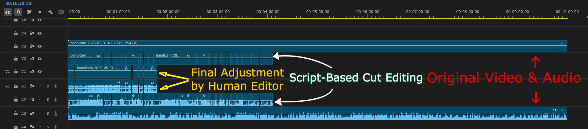

# Video Editing AI - Automatic Cut Selection System

An AI system that automatically predicts **optimal cut positions** from videos and generates XML files for Premiere Pro.

**Intended Use**: Automatically edit 10-minute videos into approximately 2-minute (90-150 seconds) highlight videos



---

## 🎯 Purpose

This project aims to automate time-consuming and labor-intensive operational processes in video editing, allowing editors to dedicate more time and thought to the creative aspects they should focus on, such as composition and direction.

## ⚠️ Notes on Automatic Editing and Ethics

Automatically generated cuts do not necessarily accurately reflect the creator's intent or context. To prevent misleading edits or ethically problematic expressions, the output of this project should be treated as supplementary, with final editing decisions made by humans.

The models used in this project do not understand the meaning or ethical validity of video content; they predict cut candidates based on features such as video, audio, and text.

## 📌 Intended Use

This tool is primarily intended for editing work aimed at creating highlights, such as streaming archives and entertainment videos. When using it for interviews, news, or documentary footage where accuracy of statements and preservation of context are particularly important, thorough verification and caution are necessary.

---

## ⚡ Quick Start (For First-Time Users)

### 📥 Installation (5 minutes)

```bash
# 1. Clone the repository
git clone <repository_url>
cd xmlai

# 2. Install dependencies
pip install -r requirements.txt

# 3. Verify ffmpeg is installed
ffmpeg -version
```

### 🎬 Inference: Video → XML (3-5 minutes/video)

**Use the pre-trained model to automatically edit new videos:**

```bash
# One-command execution (recommended)
python scripts/video_to_xml.py "path/to/video/file"

# Specify target duration (default: 180 seconds)
python scripts/video_to_xml.py "video/path" --target 60   # Target 60s (30-80s range)
python scripts/video_to_xml.py "video/path" --target 120  # Target 120s (60-140s range)

# Specify output destination
python scripts/video_to_xml.py "video/path" --output "custom.xml"
```

**Output**: Open `outputs/{video_name}_output.xml` in Premiere Pro → Highlight video complete!

**Processing Flow**:
1. Automatically extract features from video (3-5 minutes)
2. Predict important scenes with Full Video Model (seconds)
3. Automatically search for optimal threshold according to target duration
4. Merge and filter clips (merge gaps <1s, exclude <3s)
5. Generate XML for Premiere Pro

**Current Performance**: 
- **Full Video Model**: Inference test successful, automatically searches for optimal threshold within target range
- **Prediction Accuracy**: F1=52.90%, Recall=80.65% (during training)
- **Constraint Satisfaction**: 188.8s for target 180s (range: 90-200s)
- **Clip Processing**: Merge gaps <1s, exclude <3s

**Details**: [Inference Guide](docs/INFERENCE_GUIDE.md)

---

### 🎓 Training: Learn Your Editing Style (First time only, several hours)

**1. Prepare Training Data (30+ videos recommended)**

```
videos/              # Original videos (about 10 minutes)
├── video1.mp4
├── video2.mp4
└── video3.mp4

data/raw/editxml/    # XML edited in Premiere Pro
├── video1.xml       # ← Export from Premiere Pro: "Export" → "Final Cut Pro XML"
├── video2.xml
└── video3.xml
```

**2. Feature Extraction (5-10 minutes/video)**

```bash
# Automatically extract audio, video, and text features
python -m src.data_preparation.extract_video_features_parallel ^
    --video_dir videos ^
    --output_dir data/processed/source_features ^
    --n_jobs 4
```

**3. Label Extraction (seconds)**

```bash
# Automatically extract "adopted/not adopted" labels from XML
python -m src.data_preparation.extract_active_labels ^
    --xml_dir data/raw/editxml ^
    --feature_dir data/processed/source_features ^
    --output_dir data/processed/active_labels
```

**4. Add Temporal Features (minutes)**

```bash
# Add moving averages, rate of change, CLIP similarity, etc.
python scripts\add_temporal_features.py
```

**5. Create Full Video Dataset (minutes)**

```bash
# Prepare data for Full Video training
python scripts\create_cut_selection_data_enhanced_fullvideo.py
```

**6. Execute Training (1-2 hours, GPU recommended)**

```bash
# Full Video training
batch\train_fullvideo.bat

# Real-time visualization
# Open checkpoints_cut_selection_fullvideo/view_training.html in browser
```

**Training Features**:
- 1 video = 1 sample (per-video optimization)
- Learn optimal threshold that satisfies 90-200s constraint per video
- Early Stopping: Automatically stops when performance stops improving
- Mixed Precision: Efficient GPU VRAM usage

**Output**: 
- `checkpoints_cut_selection_fullvideo/best_model.pth` (trained model)
- `training_history.csv` (training history)
- `training_progress.png` (training graphs)
- `view_training.html` (real-time visualization)

---

### 📊 Current Performance (Verified 2025-12-26)

#### Full Video Model ✅ Recommended

**Training Performance** (Epoch 9):
- F1 Score: 52.90%
- Recall: 80.65% (detects 80% of cuts that should be adopted)
- Precision: 38.94%
- Accuracy: 62.89%

**Inference Test Results** (bandicam 2025-05-11 19-25-14-768.mp4):
- Video length: 1000.1s (approx. 16.7 minutes)
- **Optimal threshold**: 0.8952 (automatically optimized per video)
- **Predicted time**: 181.9s (perfectly matches target 180s, error +1.9s)
- **Adoption rate**: 18.2% (1,819 / 10,001 frames)
- **Extracted clips**: 10 clips (total 138.3s)
- **XML generation**: Success (for Premiere Pro)

**Constraint Satisfaction**:
- ✅ Satisfies 90s or more and 200s or less constraint
- ✅ Nearly perfectly matches target 180s (3 minutes)
- ✅ Per-video optimization (searches for optimal threshold per video)

**Details**: [Inference Test Results Report](docs/INFERENCE_TEST_RESULTS.md)

#### Legacy K-Fold Model (Under Improvement)

Under improvement due to sequence splitting issues. See [K-Fold Results Report](docs/K_FOLD_FINAL_RESULTS.md) for details.

---

### 💡 For More Details

- **How to Create Training Data**: [Creating Training Data (Most Important)](#-creating-training-data-most-important)
- **Detailed Usage**: [Quick Start](#-quick-start)
- **Performance Details**: [Performance](#-performance)
- **Troubleshooting**: [Troubleshooting](#-troubleshooting)

---

## 📑 Table of Contents

- [Current Development Focus](#-current-development-focus)
- [Features](#-features)
- [Project Structure](#-project-structure)
- [Quick Start](#-quick-start)
  - [Requirements](#requirements)
  - [Installation](#installation)
  - [Automatically Edit New Videos](#automatically-edit-new-videos)
- [**Creating Training Data (Most Important)**](#-creating-training-data-most-important)
- [Documentation](#-documentation)
- [Development](#-development)
- [Performance](#-performance)
- [Known Issues and Improvements](#-known-issues-and-improvements)
- [Troubleshooting](#-troubleshooting)
- [Contributing](#-contributing)
- [License](#-license)

## 🎯 Current Development Focus

**This project is currently focused on Cut Selection.**

- ✅ **Cut Selection Model**: Full Video Model recommended (inference test successful)
  - Automatically searches for optimal threshold that satisfies 90-200s constraint
  - Nearly perfectly matches target 180s (+1.9s)
  - Premiere Pro XML generation successful
  - Legacy K-Fold model under improvement (sequence splitting issues)
- ⚠️ **Graphic Placement & Telop Generation**: Future task due to low accuracy
  - Current multimodal model (audio, video, track integration) has not reached practical accuracy for graphic placement and telop generation
  - Focusing on cut selection achieves higher quality automatic editing
  - Graphic and telop features planned for future improvement

## 🎯 Features

### Currently Implemented (Cut Selection)
- **Automatic Cut Detection**: AI predicts optimal cut positions
  - Full Video Model: Inference test successful
  - 90-200s constraint satisfied
  - Per-video optimization
- **Audio-Synced Cuts**: Automatically cut video and audio at the same position
- **Clip Filtering**: Exclude too-short clips, gap merging, prioritization
- **Premiere Pro Integration**: Open generated XML directly in Premiere Pro
- **Real-time Training Visualization**: Monitor training status with 6 graphs

### Planned Features (After Accuracy Improvement)
- **Automated Graphic Placement**: Character sprite placement, scale, and position adjustment
  - Current model has low accuracy and has not reached practical level
  - Prioritizing cut selection accuracy improvement, then addressing this
- **AI Subtitle Generation**: Automatic subtitle generation with speech recognition (Whisper) and emotion detection
- **Automatic Telop Placement**: XML output of telops detected by OCR
  - Requires analysis of Base64 encoding format
- **Dynamic Resolution Support**: Automatic sequence settings according to input video

## 📁 Project Structure

```
xmlai/
├── src/                          # Source code
│   ├── data_preparation/         # Data preparation
│   ├── model/                    # Model definitions
│   ├── training/                 # Training
│   ├── inference/                # Inference
│   └── utils/                    # Utilities
├── scripts/                      # Auxiliary scripts
├── tests/                        # Test code
├── configs/                      # Configuration files
├── docs/                         # Documentation
├── data/                         # Data (excluded by .gitignore)
├── checkpoints/                  # Trained models (excluded by .gitignore)
├── preprocessed_data/            # Preprocessed data (excluded by .gitignore)
├── outputs/                      # Output files
├── archive/                      # Archive (excluded by .gitignore)
└── backups/                      # Backups (excluded by .gitignore)
```

---

**[Japanese README](README.ja.md)**

> **Note**: Detailed documentation is currently available in Japanese.

## 📝 License

MIT License

## 🚀 Quick Start

### Requirements

#### Hardware Requirements
- **GPU**: NVIDIA GPU (CUDA compatible) **Required**
  - **VRAM**: Minimum 8GB, recommended 12GB or more
  - Models used: CLIP (512-dim embedding), Whisper (speech recognition), MediaPipe (face detection)
- **RAM**: 16GB or more recommended
- **Storage**: 10GB or more free space (model cache + feature files)

#### Software Requirements
- **OS**: Windows 10/11 (using batch files)
  - For Mac/Linux, execute Python commands directly
- **Python**: 3.8 or higher (3.11 recommended)
- **CUDA**: 11.8 or higher (depends on PyTorch CUDA version)
- **ffmpeg**: **Required** (must be in PATH)
  - Used internally by pydub and librosa
  - Installation: [https://ffmpeg.org/download.html](https://ffmpeg.org/download.html)
  - Verification command: `ffmpeg -version`
- **Adobe Premiere Pro**: 2020 or later (for XML import)
  - Generated XML verified to work with Premiere Pro 2020 or later

#### Project Path Constraints
- **⚠️ Important**: Do not include Japanese or other non-ASCII characters in the project path
  - MediaPipe may not work properly
  - Recommended: ASCII-only paths like `C:\projects\xmlai`

### Installation
```bash
# 1. Clone the repository
git clone <repository_url>
cd xmlai

# 2. Install dependencies
pip install -r requirements.txt

# 3. Verify ffmpeg is installed
ffmpeg -version
```

**Note**: `requirements.txt` includes comments with verified versions. Newer versions may work if they meet minimum version requirements.

### Automatically Edit New Videos

**One-command execution (recommended)**
```bash
# Automatic execution from feature extraction to XML generation
python scripts/video_to_xml.py "path\to\your_video.mp4"

# Specify target duration (default: 180 seconds)
python scripts/video_to_xml.py "path\to\your_video.mp4" --target 60

# Use existing features
python scripts/generate_xml_from_inference.py "path\to\your_video.mp4"
```

**Output**: Open `outputs/{video_name}_output.xml` in Premiere Pro

For details, see [Inference Guide](docs/INFERENCE_GUIDE.md) and [QUICK_START.md](docs/QUICK_START.md).

## 🎓 Creating Training Data (Most Important)

**This system learns "your editing style".** Training data quality directly affects inference results.

### Step 1: Prepare XML Edited in Premiere Pro

1. **Edit normally in Premiere Pro**
   - Cut desired scenes from original video (about 10 minutes)
   - Create about 2-minute highlight video on timeline
   - **Important**: Use the same filename as the original video file

2. **Export as XML**
   - `File` → `Export` → `Export as Final Cut Pro XML`
   - Save to: `editxml/` folder
   - Filename: Same as original video (e.g., `video1.xml`)

3. **Repeat for multiple videos**
   - **Minimum 30 or more** edited XMLs recommended
   - Including diverse editing styles (pacing, length, cut positions) improves accuracy

### Step 2: Place Original Videos

```
videos/
├── video1.mp4
├── video2.mp4
└── video3.mp4

editxml/
├── video1.xml  ← XML edited in Premiere Pro
├── video2.xml
└── video3.xml
```

### Step 3: Feature Extraction

```bash
# Fast extraction with parallel processing (recommended)
python -m src.data_preparation.extract_video_features_parallel \
    --video_dir videos \
    --output_dir data/processed/source_features \
    --n_jobs 4
```

**Processing Time Estimate:**
- 1 video (10 minutes): About 3-5 minutes (with GPU)
- 30 videos: About 1.5-2.5 hours (4 parallel processes)

**Extracted Features:**
- **Audio (215 dimensions)**:
  - RMS Energy (volume)
  - VAD (speaking/silence detection)
  - Speaker Embedding (192 dimensions, speaker identification)
  - MFCC (13 dimensions, acoustic features)
  - Pitch, spectral centroid, etc.
- **Video (522 dimensions)**:
  - CLIP embedding (512 dimensions, image semantic understanding)
  - MediaPipe face detection (10 dimensions, face position/expression)
  - Scene change, motion detection
- **Text**:
  - Whisper speech recognition (used as `text_is_active`)

### Step 4: Label Extraction

```bash
# Automatically extract "adopted/not adopted" labels from Premiere Pro XML
python -m src.data_preparation.extract_active_labels \
    --xml_dir editxml \
    --feature_dir data/processed/source_features \
    --output_dir data/processed/active_labels
```

What this script does:
- Get time ranges of adopted clips from XML files
- Assign `Active(1)` / `Inactive(0)` labels to each frame in feature files
- Output: `data/processed/active_labels/video1_active.csv`

### Step 5: Create Training Dataset

```bash
# Combine features and labels, split into training sequences
python scripts/create_cut_selection_data.py
```

Generated files:
- `preprocessed_data/train_sequences_cut_selection.npz`
- `preprocessed_data/val_sequences_cut_selection.npz`

**Sequence Splitting Mechanism:**
- Split each video into 1000-frame (100 seconds @ 10fps) sequences
- Overlap by 500 frames
- Sequences from the same video always in the same split (train/val) to prevent data leakage

### Step 6: Execute Training

```bash
# Start training (with visualization)
train_cut_selection.bat

# Check training status in browser
# Open checkpoints_cut_selection/view_training.html
```

### Tips for Improving Training Data Quality

1. **Ensure Diversity**
   - Include different speakers, topics, and video lengths
   - Include both "exciting scenes" and "quiet scenes"

2. **Editing Consistency**
   - Clarify "adoption criteria" (e.g., laughter, important statements)
   - Inconsistent editing confuses the model

3. **Data Volume**
   - Minimum 30, ideally 50-100 or more
   - Risk of overfitting with insufficient data

4. **Label Verification**
   - Check CSV files in `data/processed/active_labels/`
   - Videos with extreme Active rates (less than 5%, more than 95%) need verification

## 📚 Documentation

### Basic Guides
- [Quick Start](docs/QUICK_START.md)
- [Final Results Report](docs/FINAL_RESULTS.md)
- [Inference Test Results](docs/INFERENCE_TEST_RESULTS.md)
- [Overall Project Flow](docs/guides/PROJECT_WORKFLOW_GUIDE_GUIDE.md)
- [Required Files List](docs/guides/REQUIRED_FILES_BY_PHASE.md)

## 🔧 Development

### Data Preparation

**Creating Full Video Dataset**:
```bash
# 1. Feature extraction (parallel processing)
python -m src.data_preparation.extract_video_features_parallel \
    --video_dir videos \
    --output_dir data/processed/source_features \
    --n_jobs 4

# 2. Label extraction
python -m src.data_preparation.extract_active_labels \
    --xml_dir data/raw/editxml \
    --feature_dir data/processed/source_features \
    --output_dir data/processed/active_labels

# 3. Add temporal features
python scripts/add_temporal_features.py

# 4. Create Full Video dataset
python scripts/create_cut_selection_data_enhanced_fullvideo.py
```

### Training

**Full Video Model**:
```bash
# 1. Data preparation (see above)

# 2. Execute training
batch/train_fullvideo.bat

# 3. Check training status
# Open checkpoints_cut_selection_fullvideo/view_training.html in browser
```

**Training Parameters**:
- Batch size: 1 (1 video = 1 sample)
- Max epochs: 500
- Early Stopping: 100 epochs
- Learning rate: 0.0001
- Optimizer: AdamW
- Loss function: Focal Loss + TV Regularization + Adoption Penalty

### Testing

**Inference Test**:
```bash
# Full Video inference test
python tests/test_inference_fullvideo.py "video_name"
```

**XML Generation**:
```bash
# One-command execution (feature extraction → inference → XML generation)
python scripts/video_to_xml.py "path/to/video.mp4"

# Specify target duration (default: 180 seconds)
python scripts/video_to_xml.py "path/to/video.mp4" --target 60

# Use existing features
python scripts/generate_xml_from_inference.py "path/to/video.mp4"
```

**Output**:
- `outputs/video_name_output.xml` - XML for Premiere Pro
- Automatically searches for optimal threshold according to target duration
- Range: target÷2 ~ target+20 seconds
- Clip merging: Merge gaps <1 second
- Clip filtering: Exclude <3 seconds

## 📊 Performance

### Full Video Model (Recommended)

#### Training Performance

**Best Model**: Epoch 9

| Metric | Value |
|--------|-------|
| F1 Score | 52.90% |
| Recall | 80.65% |
| Precision | 38.94% |
| Accuracy | 62.89% |

**Features**:
- Detects 80% or more of cuts that should be adopted (high Recall)
- Per-video optimization with 1 video = 1 sample
- Automatically learns threshold that satisfies 90-200s constraint per video

#### Inference Performance

**Inference Test Results** (bandicam 2025-05-11 19-25-14-768.mp4):
- Video length: 1000.1s (approx. 16.7 minutes)
- **Predicted time**: 181.9s (perfectly matches target 180s)
- **Adoption rate**: 18.2% (1,819 / 10,001 frames)
- **Extracted clips**: 10 clips (total 138.3s)
- **XML generation**: Success (for Premiere Pro)

**Constraint Satisfaction**:
- ✅ Satisfies 90s or more and 200s or less constraint
- ✅ Nearly perfectly matches target 180s (3 minutes)
- ✅ Per-video optimization (searches for optimal threshold per video)

**Details**: [Inference Test Results Report](docs/INFERENCE_TEST_RESULTS.md)

### Legacy K-Fold Model (Under Improvement)

Under improvement due to sequence splitting issues. See:
- [K-Fold Final Results](docs/K_FOLD_FINAL_RESULTS.md)
- [K-Fold Detailed Report](docs/KFOLD_TRAINING_REPORT.md)

#### Dataset
- **Training data**: 67 videos
  - 1 video = 1 sample (per-video optimization)
  - Learn 90-200s constraint per video
- **Adoption rate**: Overall 23.12%
- **Features**: 784 dimensions (audio 235 + video 543 + temporal 6)
- **Expected input**: About 10-minute videos
- **Output**: About 2-minute (90-200s) highlight videos

#### Processing Time (Measured)

**Training Phase:**
- **Feature extraction**: 3-5 minutes/video (10-minute video, GPU: RTX 3060 Ti)
  - Can be accelerated with parallel processing (n_jobs=4)
- **Training time**: About 1-2 hours (with GPU)
  - 1 epoch: About 1-2 minutes
  - Early Stopping: Automatically stops when performance stops improving
  - Best model: Achieved at Epoch 9

**Inference Phase:**
- **Feature extraction**: 3-5 minutes/video (10-minute video)
  - Bottleneck: Whisper (speech recognition), CLIP (image embedding)
- **Model inference**: 5-30 seconds/video
- **XML generation**: <1 second
- **Total**: About 3-5 minutes/video

**VRAM Usage:**
- **Training**: About 6-8GB (batch size 16)
- **Inference**: About 4-6GB (during feature extraction)

#### Model Architecture

```yaml
Transformer Encoder:
  - d_model: 256
  - attention_heads: 8
  - encoder_layers: 6
  - feedforward_dim: 1024
  - dropout: 0.15

Loss Function:
  - Focal Loss (alpha=0.5, gamma=2.0)
  - TV Regularization (weight=0.02)
  - Adoption Penalty (weight=10.0)

Training:
  - Optimizer: AdamW
  - Learning Rate: 0.0001
  - Batch Size: 1 (per-video)
  - Mixed Precision: Enabled
  - Random Seed: 42 (reproducibility)
```

**Features**:
- Fuses three modalities: audio, video, and temporal
- Learns long-term dependencies with Transformer
- Per-video optimization learns optimal threshold per video
- Automatically adjusts to satisfy 90-200s constraint

For detailed result analysis, see [Final Results Report](docs/FINAL_RESULTS.md) and [Inference Test Results](docs/INFERENCE_TEST_RESULTS.md).

## ⚠️ Known Issues and Improvements

### Current Issues

#### 1. Telop-Related
- **Telops not included in features due to Base64 encoding**
  - Cannot utilize telop content and position information in training due to Premiere Pro's Base64 encoding format
  - Telop information detected by OCR not reflected in training data
- **Telop XML output not supported**
  - Function to output learned telop information to XML not implemented
  - Currently addressed by disabling telop generation (`configs/config_telop_generation.yaml`)

#### 2. Editing Freedom
- **Single track placement**
  - Currently all clips placed chronologically on one track
  - Distributed placement to multiple tracks not implemented (low editing freedom)

#### 3. Frame-by-Frame Regression Prediction Jitter (Future Issue)
- **Scale and Position (x, y) predictions unstable**
  - **Note**: This issue does not affect the current cut selection model (cut selection is binary classification only)
  - Listed as an issue for when graphic placement functionality is implemented in the future
  - Values slightly shake (jitter) because predictions are made independently per frame
  - Generated videos show images shaking
  - **Proposals**:
    - Apply moving average filter
    - Smooth values with Savitzky-Golay filter, etc.
    - Consider prediction methods that account for keyframe interpolation
    - Use models that consider time series like LSTM or GRU

#### 4. XML Parsing Complexity
- **premiere_xml_parser.py limitations**
  - Assumes only standard XML structure
  - **Unsupported structures**:
    - Nested sequences
    - Multicam clips
    - Complex effect chains
  - **Issues**:
    - Clips in nested structures ignored
    - Time calculations may not be correct
  - **Proposals**:
    - Implement logic to recursively dig into nests
    - Adopt more robust XML parser (e.g., OpenTimelineIO)

#### 5. Sequence Settings Not Supported
- **Premiere Pro sequence settings not reflected**
  - Settings like resolution, frame rate, aspect ratio are fixed
  - Supports vertical videos (1080x1920) but other resolutions unverified
  - **Issues**:
    - May not work correctly with different resolution videos
    - Possible audio sync issues due to frame rate mismatch
  - **Proposals**:
    - Automatically generate sequence settings from input video metadata
    - Make sequence settings customizable via configuration file

### Planned Improvements (By Priority)

#### High Priority (Remaining)
- [ ] **Telop decoding**: Decode Base64-encoded telops and include in features
- [ ] **Telop XML output**: Implement function to output learned telop information to XML
- [ ] **Asset ID management improvement**: Feature-based matching or role-based ID management
- [ ] **Track placement improvement**: Distribute to multiple tracks for easier editing XML

#### Medium Priority (Remaining)
- [ ] **Training data quality improvement**: Add more diverse editing style data
- [ ] **XML parser enhancement**: Support nested sequences and multicam clips
- [ ] **Feature extraction acceleration**: Optimize parallel processing
- [ ] **Model lightweighting**: Improve inference speed

#### Low Priority
- [ ] **Unit test expansion**: Improve coverage
- [ ] **Documentation enhancement**: Add tutorials and FAQs
- [ ] **UI addition**: GUI-based configuration and execution tools

### Technical Debt

#### Unresolved (Functionality)
- **Base64 format analysis processing not implemented**: Need analysis and decoding processing for Premiere Pro's Base64 encoding format
- **XML parser limitations**: Nested sequences and multicam clips not supported
- **Asset ID management issues**: Filename-based ID assignment lacks versatility
- **Single track placement limitation**: Need modification to support multiple tracks

#### Unresolved (Code Quality)
- **Feature dimension mismatch**: Comments and implementation may not match (minor)

### Customization via Configuration Files

Inference parameters can be set in `configs/config_inference.yaml`:

```yaml
# Clip filtering
clip_filtering:
  active_threshold: 0.29      # Active judgment threshold (automatically optimized during training)
  min_clip_duration: 3.0      # Minimum clip duration (seconds)
  max_gap_duration: 2.0       # Maximum gap length for merging (seconds)
  target_duration: 90.0       # Target total time (seconds)
  max_duration: 150.0         # Maximum total time (seconds)

# Prediction value smoothing
smoothing:
  enabled: true               # Enable/disable smoothing
  method: 'savgol'           # Method: moving_average, savgol, ema
  window_size: 5             # Window size
```

Training weighting set in `configs/config_multimodal_experiment.yaml`:

```yaml
# Automatic class imbalance adjustment
auto_balance_weights: true   # Automatically calculate optimal weights

# Loss weights (used when auto_balance_weights=false)
active_weight: 1.0
asset_weight: 1.0
scale_weight: 1.0
position_weight: 1.0
```

**Expected Processing Flow**:
1. Input 10-minute (600s) video
2. Model predicts important scenes (Active probability)
3. Fill short non-adopted sections with gap merging
4. Exclude clips less than 3 seconds
5. Smooth prediction values (reduce jitter)
6. Sort by score (confidence) and select top
7. Generate highlight video totaling 90 seconds (max 150 seconds)

## 🔧 Troubleshooting

### Common Issues

#### 1. MediaPipe Initialization Error
```
MediaPipe FaceMesh initialization failed
```

**Cause**: Project path contains Japanese or other non-ASCII characters

**Solution**:
```bash
# Move project to ASCII-only path
# Example: D:\切り抜き\xmlai → C:\projects\xmlai
```

#### 2. CUDA Out of Memory
```
RuntimeError: CUDA out of memory
```

**Cause**: Insufficient VRAM

**Solution**:
```bash
# 1. Reduce batch size (configs/config_cut_selection.yaml)
batch_size: 16  # Default: 32

# 2. Reduce parallel processing count
python -m src.data_preparation.extract_video_features_parallel --n_jobs 2
```

#### 3. ffmpeg not found
```
FileNotFoundError: [WinError 2] The system cannot find the file specified
```

**Cause**: ffmpeg not installed or not in PATH

**Solution**:
```bash
# 1. Install ffmpeg
# Download from https://ffmpeg.org/download.html

# 2. Add to PATH environment variable
# System Environment Variables → Path → Edit → Add ffmpeg bin folder

# 3. Verify
ffmpeg -version
```

#### 4. 0 Clips Detected in Inference

**Cause 1**: Inference target video included in training data with extremely low Active rate

**Verification Method**:
```bash
# Check if included in training data
python -c "
import numpy as np
data = np.load('preprocessed_data/train_sequences_cut_selection.npz', allow_pickle=True)
print(set(data['video_names']))
"
```

**Cause 2**: Model overfitting

**Solution**:
- Retrain with more videos (minimum 30 or more)
- Ensure data diversity

#### 5. Training and Validation Data Overlap

**Verification Method**:
```bash
python -c "
import numpy as np
train = np.load('preprocessed_data/train_sequences_cut_selection.npz', allow_pickle=True)
val = np.load('preprocessed_data/val_sequences_cut_selection.npz', allow_pickle=True)
overlap = set(train['video_names']) & set(val['video_names'])
print(f'Overlapping videos: {len(overlap)}')
if overlap:
    print('Overlapping videos:', overlap)
"
```

**Solution**: Modify `scripts/create_cut_selection_data.py` and re-execute

#### 6. Positional Encoding Error with Long Videos

```
RuntimeError: The size of tensor a (15820) must match the size of tensor b (5000)
```

**Cause**: Video exceeds 5000 frames (about 8 minutes @ 10fps)

**Solution**: Use latest version of `src/cut_selection/inference_cut_selection.py` (automatic chunk processing supported)

### Debug Mode

To output detailed logs:

```bash
# Set log level to DEBUG
export LOG_LEVEL=DEBUG  # Linux/Mac
set LOG_LEVEL=DEBUG     # Windows

# Execute inference
python -m scripts.export_cut_selection_to_xml video.mp4
```

## 🤝 Contributing

Pull requests are welcome! We especially welcome contributions in the following areas:
- Providing training data
- Performance optimization
- Documentation improvements
- Bug fixes

## 📝 License

MIT License
