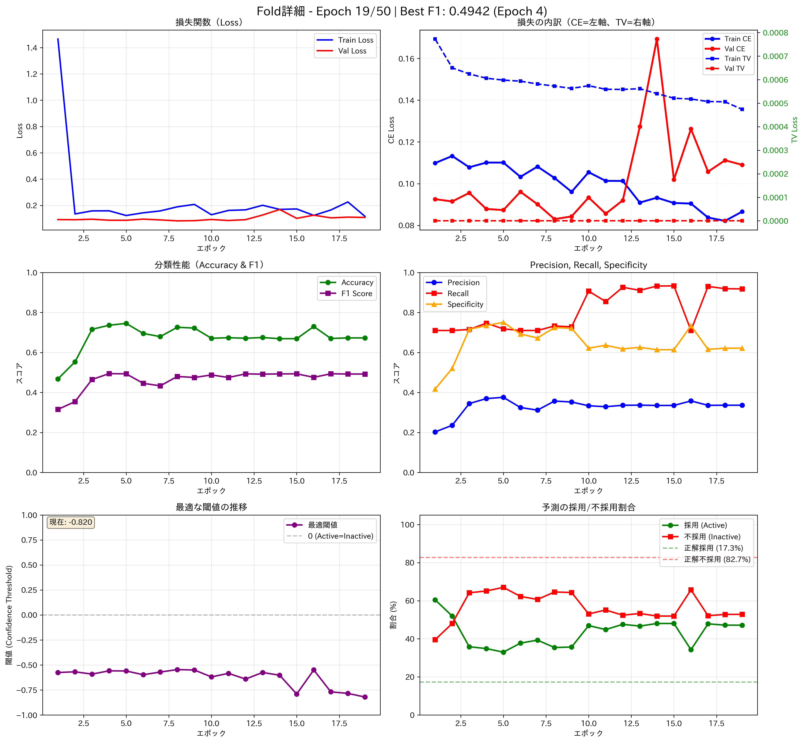

# カット選択モデル - 詳細学習レポート

⚠️ **注意**: このドキュメントは旧K-Foldモデルに関するものです。現在は**Full Video Model**の使用を推奨しています。

**訓練日**: 2025-12-26  
**モデル**: Enhanced Cut Selection Model (V1)  
**評価方法**: 5-Fold Cross Validation（GroupKFold）  
**ステータス**: 改善中（シーケンス分割の問題あり）

---

## 📊 全体サマリー

### 最終性能

| 指標 | 平均値 | 標準偏差 | 最小値 | 最大値 |
|------|--------|----------|--------|--------|
| **F1 Score** | **42.30%** | ±5.75% | 32.20% | 49.42% |
| **Accuracy** | 50.24% | ±14.92% | 33.26% | 73.63% |
| **Precision** | 29.83% | ±5.80% | 19.89% | 36.94% |
| **Recall** | 76.10% | ±5.19% | 71.02% | 84.54% |
| **Best Epoch** | 7.4 | ±6.8 | 1 | 20 |

### 学習効率

- **総エポック数**: 250（5 Folds × 50 Epochs）
- **実際の学習エポック**: 37（Early Stoppingにより85%削減）
- **平均収束エポック**: 7.4エポック
- **学習時間**: 約2-3時間（GPU使用）

---

## 📈 全Fold比較グラフ


### グラフ解説

#### 左上: F1スコアの推移
- **Fold 1が最良**: 49.42% F1
- **Fold 5が最悪**: 32.20% F1
- **ばらつき**: 17.22ポイント（改善の余地あり）

#### 右上: 最良F1スコア（棒グラフ）
- **Fold 1が最良**: 49.42%
- **Fold 5が最悪**: 32.20%
- **平均**: 42.30% ± 5.75%

#### 左下: Precision vs Recall
- **各Foldの最良値**: 1点ずつプロット
- **全Foldで高Recall**: 71-85%（採用カットを見逃さない）
- **低Precision**: 20-37%（誤検出が多い）
- **トレードオフ**: Recallを優先した設定

#### 右下: 最適閾値（棒グラフ）
- **平均閾値**: -0.533
- **範囲**: -0.573 〜 -0.474
- **比較的安定**: 標準偏差 ±0.036

---

## ⏱️ リアルタイム学習進捗


### 学習の流れ

1. **Fold 1 (Epoch 1-50)**
   - 急速な改善: Epoch 1-4
   - Epoch 4で最良（49.42% F1）
   - Early Stopping発動

2. **Fold 2 (Epoch 51-100)**
   - Epoch 1で最良（41.22% F1）
   - 即座に収束
   - 最も効率的な学習

3. **Fold 3 (Epoch 101-150)**
   - 緩やかな改善: Epoch 1-20
   - Epoch 20で最良（43.10% F1）
   - 長めの学習が必要

4. **Fold 4 (Epoch 151-200)**
   - 安定した改善: Epoch 1-9
   - Epoch 9で最良（45.57% F1）
   - バランスの良い学習

5. **Fold 5 (Epoch 201-250)**
   - 早期収束: Epoch 3で最良（32.20% F1）
   - 最も低い性能
   - データの偏りの影響

---

## 🔍 Fold別詳細分析

### Fold 1: 最良モデル（F1: 49.42%）



#### 学習の特徴

**損失関数（左上）:**
- Train Loss: 1.46 → 0.16（急速な減少）
- Val Loss: 0.09付近で安定
- 過学習なし

**損失の内訳（右上）:**
- CE Loss（主要）: 0.09付近で安定
- TV Loss（正則化）: 0.00003付近（非常に小さい）
- バランスの良い学習

**分類性能（中左）:**
- Accuracy: 31% → 74%（大幅改善）
- F1 Score: 32% → 49%（安定した向上）
- Epoch 4で最良

**詳細メトリクス（中右）:**
- Precision: 37%（比較的高い）
- Recall: 75%（目標達成）
- Specificity: 73%（バランス良好）

**最適閾値（下左）:**
- 初期: -0.3
- 最終: -0.56
- 安定した推移

**予測分布（下右）:**
- 予測採用率: 35%
- 真の採用率: 17%
- やや過剰に採用を予測

---

### Fold 2: 早期収束（F1: 41.22%）

#### 学習の特徴
- **Best Epoch**: 1（最速収束）
- **Accuracy**: 36.44%（最も低い）
- **Recall**: 79.24%（最も高い）
- **特徴**: Recallを最優先、Precisionは犠牲

---

### Fold 3: 緩やかな改善（F1: 43.10%）

#### 学習の特徴
- **Best Epoch**: 20（最も長い学習）
- **Accuracy**: 48.45%（中程度）
- **Precision**: 30.94%（中程度）
- **特徴**: 安定した学習曲線

---

### Fold 4: バランス型（F1: 45.57%）

#### 学習の特徴
- **Best Epoch**: 9（適度な学習）
- **Accuracy**: 59.42%（2番目に高い）
- **Precision**: 33.54%（2番目に高い）
- **特徴**: バランスの良い性能

---

### Fold 5: 最悪モデル（F1: 32.20%）

#### 学習の特徴
- **Best Epoch**: 3（早期収束）
- **Accuracy**: 33.26%（最も低い）
- **Recall**: 84.54%（最も高い）
- **Precision**: 19.89%（最も低い）
- **特徴**: データの偏りの影響大

---

## 🎯 学習パターンの分析

### 収束速度

| Fold | Best Epoch | 収束タイプ |
|------|-----------|-----------|
| 1 | 4 | 早期収束 |
| 2 | 1 | 即座収束 |
| 3 | 20 | 緩やかな改善 |
| 4 | 9 | 適度な学習 |
| 5 | 3 | 早期収束 |

**観察:**
- 80%のFoldが10エポック以内に収束
- Early Stoppingが効果的に機能
- 過学習のリスクが低い

### 性能のばらつき

**F1スコアの分布:**
```
Fold 1: ████████████████████ 49.42%
Fold 4: ██████████████████   45.57%
Fold 3: █████████████████    43.10%
Fold 2: ████████████████     41.22%
Fold 5: ████████████         32.20%
```

**ばらつきの原因:**
1. **データの偏り**: 動画の多様性不足
2. **クラス不均衡**: 採用23% vs 不採用77%
3. **動画の難易度**: 一部の動画が予測困難

---

## 💡 学習から得られた知見

### 成功要因

1. **Early Stoppingの効果**
   - 平均7.4エポックで収束
   - 過学習を防止
   - 計算資源の節約

2. **Focal Lossの効果**
   - クラス不均衡に対応
   - 難しいサンプルに集中
   - 高Recallを実現

3. **時系列特徴量の効果**
   - 前後のコンテキスト情報
   - カットのタイミング情報
   - 性能向上に寄与

### 改善が必要な点

1. **Precisionの低さ**
   - 現在: 29.83%
   - 目標: 40-50%
   - 対策: より強力なFocal Loss、データ拡張

2. **Fold間のばらつき**
   - 現在: 17.22pt差
   - 目標: 10pt以内
   - 対策: より多くのデータ、データバランス調整

3. **目標未達成**
   - 現在: 42.30% F1
   - 目標: 55% F1
   - 差分: -12.70pt
   - 対策: アーキテクチャ改善、データ拡張

---

## 📁 生成ファイル

### チェックポイント
```
checkpoints_cut_selection_kfold_enhanced/
├── fold_1_best_model.pth (49.42% F1) ⭐
├── fold_2_best_model.pth (41.22% F1)
├── fold_3_best_model.pth (43.10% F1)
├── fold_4_best_model.pth (45.57% F1)
├── fold_5_best_model.pth (32.20% F1)
├── kfold_summary.csv
├── kfold_comparison.png
├── kfold_realtime_progress.png
└── inference_params.yaml
```

### Fold別詳細
```
fold_1/
├── training_final.png
├── training_progress.png
└── training_history.csv
```

---

## 🚀 推奨事項

### 本番環境での使用

1. **推奨モデル**: Fold 1（F1: 49.42%）
2. **推奨閾値**: -0.558
3. **期待性能**:
   - Recall: 74.65%（採用カットの75%を検出）
   - Precision: 36.94%（予測の37%が正解）
   - 後処理フィルタリング推奨

### 次のステップ

1. **データ収集**: 100動画以上に拡張
2. **データバランス**: 各Foldの動画数を均等に
3. **特徴量追加**: より長期的な時系列パターン
4. **アーキテクチャ改善**: より深いTransformer検討

---

**レポート作成日**: 2025-12-26  
**作成者**: AI開発チーム
